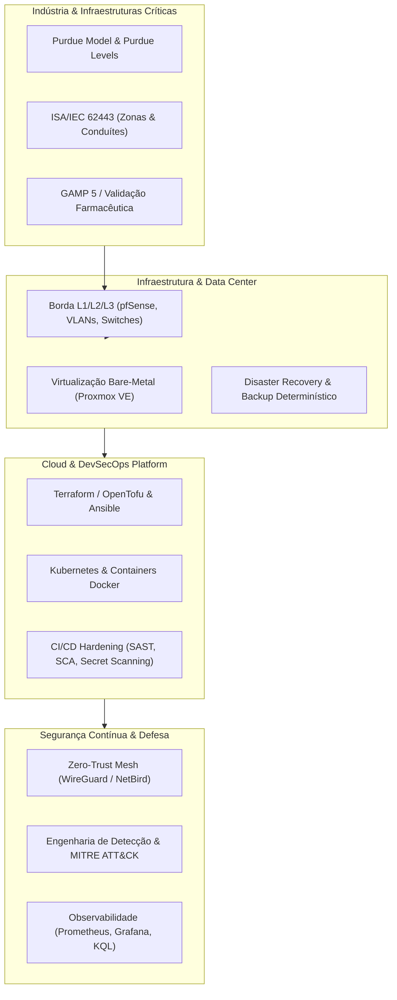
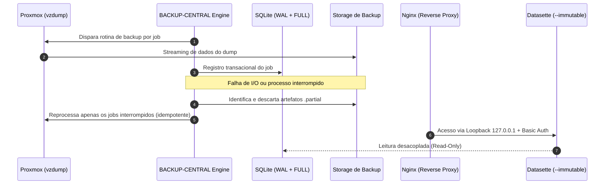
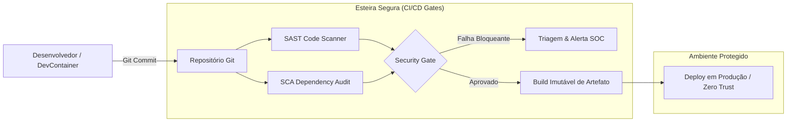
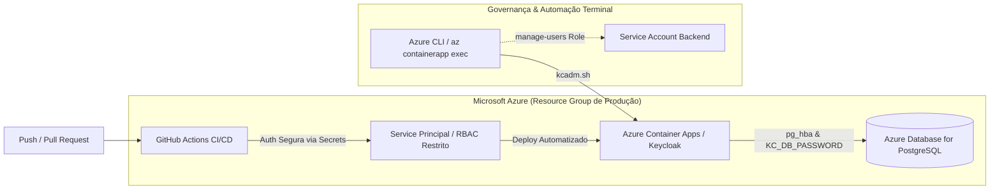

<div align="center">

# Michael Mendes Mendonça
### Infrastructure Architect · Senior DevSecOps & Cloud Security · Critical Systems Resilience

*Engenharia de infraestrutura, automação de esteiras seguras e garantia de disponibilidade determinística para ambientes de missão crítica.*

[](https://github.com/mister-m-1337)
[](https://linkedin.com/in/michael-mendes-ot-security)
[](mailto:michaelmmendonca@gmail.com)
[](#)

</div>

---

## 🏛️ Visão Arquitetural

Atuo na interseção entre **infraestrutura de baixo nível, resiliência industrial regulada e engenharia de nuvem moderna**. Minha base técnica provém do bare-metal e data centers — comutação L1/L2, roteamento, virtualização e storage — estendendo-se a ambientes OT/ICS governados por **ISA/IEC 62443**, segmentação pelo **Purdue Model** e validação de sistemas computadorizados sob diretrizes **GAMP 5**.

Sobre essa fundação de alta confiabilidade, construo plataformas declarativas com **Terraform / OpenTofu**, orquestração de microsserviços com **Kubernetes** e esteiras CI/CD seguras orientadas a **Shift-Left Security**, garantindo que controles de segurança e governança sejam declarativos e testados no código.

> *Um sistema só é confiável quando seu comportamento sob falha é previsível.*

| Princípio | Aplicação Prática |
| :--- | :--- |
| **Zero-Trust** | Nenhum segmento é confiável por padrão; identidade, microsegmentação e overlay cifrado (WireGuard/NetBird) substituem perímetros planos. Serviços administrativos expostos apenas em loopback atrás de proxy reverso autenticado. |
| **Imutabilidade** | Infraestrutura como código versionada, artefatos reprodutíveis e camadas de observabilidade em modo somente-leitura. Mudanças são sempre um novo estado declarado, nunca uma intervenção in-place não rastreada. |
| **Observabilidade Aplicada** | Métricas, telemetria de logs e trilhas de auditoria desacoplados do plano de escrita. A infraestrutura de observabilidade sobrevive à eventual falha do sistema que monitora. |
| **Tolerância a Falhas** | Durabilidade transacional explícita, rotinas de *self-healing* idempotentes e runbooks determinísticos de recuperação contra desastres. |
| **Governança & Risco** | Conformidade tratada como requisito de código (ISA/IEC 62443, GAMP 5, MITRE ATT&CK), com evidências e testes gerados pela própria esteira automatizada. |

---

## 🗺️ Ecossistema de Atuação



---

## 🛠️ Stack Tecnológica & Domínios

**Cloud & Containers**<br>


**IaC & Automação**<br>


**Redes & Borda**<br>


**Cibersegurança & SOC**<br>


**OT / ICS Crítico**<br>


**Virtualização & Métricas**<br>


| Domínio | Ferramentas & Tecnologias | Escopo de Atuação |
| :--- | :--- | :--- |
| **Cloud & Containers** | `AWS` `Azure` `Kubernetes` `Docker` | Landing zones, governança IAM (least privilege), policies de admissão e orquestração de containers distribuídos. |
| **IaC & Automação** | `Terraform` `OpenTofu` `Ansible` `Python` `Bash` | Módulos reutilizáveis, state remoto centralizado com lock, prevenção de drift e runbooks automatizados. |
| **Redes & Borda** | `pfSense` `Fortinet` `WireGuard` `NetBird` `VLANs` | Topologias L2/L3 corporativas, segmentação 802.1Q, firewalls NGFW, Outbound NAT e redes mesh criptografadas. |
| **Cibersegurança & SOC** | `MITRE ATT&CK` `SIEM/SOAR` `Burp Suite` `Nessus` | Threat intelligence, caça a ameaças (threat hunting), engenharia de detecção e contenção de incidentes. |
| **OT / ICS Crítico** | `ISA/IEC 62443` `Modbus` `DNP3` `SCADA` `GAMP 5` | Hardening de ativos operacionais, mitigação de protocolos industriais e qualificação de sistemas críticos (CSV). |
| **Virtualização & Métricas** | `Proxmox VE` `Prometheus` `Grafana` `KQL` | Clusters bare-metal, storage redundante, painéis de camada 7 e telemetria avançada de logs. |

---

## 🚀 Projetos Arquiteturais em Destaque

### 1. BACKUP-CENTRAL — Resiliência & Disaster Recovery para Proxmox
*Ecossistema autônomo de proteção e backup determinístico de máquinas virtuais e containers, desenhado para tolerar falhas de processo e manter integridade absoluta do catálogo de auditoria.*

* **Hardening Transacional em SQLite:** Implementação do motor de dados sob `PRAGMA journal_mode=WAL` e `PRAGMA synchronous=FULL`, prevenindo lockings concorrentes e corrupção em cenários de corte abrupto de energia.
* **Autonomia e Self-Healing:** Rotina de startup que identifica artefatos `.partial`, descarta os arquivos inconsistentes e reprocessa de forma idempotente apenas os jobs interrompidos, sem reexecutar o ciclo completo.
* **Observabilidade Desacoplada e Imutável:** Interface Datasette configurada com a diretiva `--immutable` apontando para snapshots somente-leitura, eliminando bloqueios contra o writer primário do sistema.
* **Segurança de Borda em Loopback:** Painel administrativo isolado na interface local `127.0.0.1`, publicado por proxy reverso Nginx com autenticação e headers defensivos (`Content-Security-Policy`, `X-Frame-Options`, `X-Content-Type-Options`).
* **Telemetria de SLOs:** Exportação de métricas para Prometheus e Grafana para acompanhamento em tempo real de RPO, tempos de execução e volume de dados.



---

### 2. Auditoria de Borda & Otimização L1/L2 — Enterprise Network Infrastructure
*Diagnóstico determinístico e reengenharia arquitetural na borda corporativa, eliminando saturação de tráfego, tempestades de broadcast e anomalias de Camada 2.*

```text
  CENÁRIO ANTES (Saturação L2)                  CENÁRIO DEPOIS (Arquitetural Correto)
  ─────────────────────────────                 ─────────────────────────────────────
  [Link WAN]                                    [Link WAN]
       │                                             │
  [Firewall Appliance]                          [Firewall Appliance]
  └── bridge0 (Software Bridge)                      ├── Interface Trunk (802.1Q)
       ├── Porta igb1 ──[Switch A]                   │     ├── VLAN 10 (Gestão & Borda)
       ├── Porta igb2 ──[Switch B]                   │     ├── VLAN 20 (Servidores & BD)
       └── Porta igb3 ──[Switch C]                   │     └── VLAN 30 (Estações de Trabalho)
             ↑ Loop L2 / MAC Flapping                │
             ↑ CPU em 100% (Interrupt Storms)   [Switch Core L2/L3 Dedicado]
             ↑ Autonegociação em 100baseTX           ├── 1000baseT Full-Duplex Verificado
             ↑ NAT Automático sem Governança         └── Outbound NAT Determinístico
```

* **Desconstrução de Software Bridge:** Remoção da carga de comutação L2 da CPU do firewall, delegando a camada de broadcast e forwarding para hardware dedicado (Switches Core), sanando eventos severos de *MAC flapping*.
* **Saneamento L1/L2:** Correção determinística de auto-negociações degradadas (forçando e validando enlaces a **1000baseT Full-Duplex** sem descarte de quadros).
* **Estabilização de Estados:** Governança das tabelas de estado (State Tables) e substituição de NAT automático por regras explícitas de Outbound NAT por segmento.

---

### 3. Pipeline Hardening & Software Supply Chain Defense
*Arquitetura de esteira CI/CD segura orientada a mitigar vetores complexos de evasão de código e comprometimento de estações de trabalho de engenharia.*



* **Defesa contra APTs & Supply Chain:** Mitigação de ataques em dependências de segundo nível, identificando código malicioso em pacotes aparentemente benignos — com base em campanhas atribuídas a agentes norte-coreanos na esteira de supply chain e engenharia social (ex.: malware OTTERCOOKIE / campanha *Contagious Interview*).
* **Isolamento de Runtime:** Padronização de desenvolvimento em ambientes isolados (DevContainers), impedindo execução de scripts arbitrários diretamente no host da estação de trabalho.
* **Gates Bloqueantes:** Inclusão de scanners SAST/SCA e Secret Scanning como critérios de reprovação automática na esteira de integração contínua.

---

### 4. Cloud Identity & CI/CD Platform Architecture — Azure & Keycloak
*Engenharia de identidade corporativa, automação de esteiras CI/CD seguras e sustentação de microsserviços em produção no ecossistema Microsoft Azure.*

* **Sustentação de Identidade & Contêineres:** Diagnóstico e resolução de falhas críticas de startup no **Azure Container Apps** hospedando o Keycloak. Mapeamento de regras de rede e firewall (`pg_hba.conf` / "Permitir serviços do Azure") no **Azure Database for PostgreSQL**, sincronização determinística de segredos em runtime (`KC_DB_PASSWORD`) e estabilização de revisões de contêiner.
* **Refatoração de CI/CD com Least Privilege (GitHub Actions):** Pivotagem pragmática de runners locais instáveis para autenticação desacoplada via Service Principal corporativo (`az ad sp create-for-rbac`). Aplicação estrita de RBAC delimitada exclusivamente ao escopo do Resource Group de produção e injeção segura de credenciais via GitHub Secrets em esteiras separadas de backend e frontend.
* **Administração de Identity Provider via Terminal (kcadm):** Mitigação de indisponibilidade da interface gráfica através de injeção direta de comandos no runtime do contêiner (`az containerapp exec`), governança de contexto de assinatura (`az account set`) e provisionamento automatizado de roles administrativas (`manage-users`) para Service Accounts de backend.



---

## 🎤 Liderança Técnica & Palestras

* **Palestra: "FinOps: Quando seu Pipeline Deploya Dinheiro, Não Só Código"**  
  *Conferência PorteraTech / Hub Goiás*  
  Discussão executiva sobre o impacto financeiro de decisões técnicas em pipelines de entrega contínua. Métodos para introduzir governança de custos em arquiteturas de nuvem (*Policy-as-Code* e alocação via IaC) sem comprometer resiliência, tolerância a falhas ou segurança operacional.

---

<div align="center">

<sub>Arquitetura resiliente não é a ausência de falhas — é a previsibilidade do comportamento quando elas acontecem.</sub>

</div>
