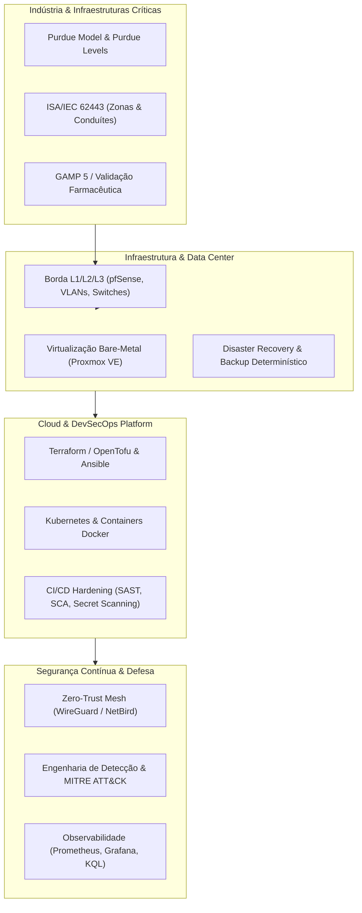
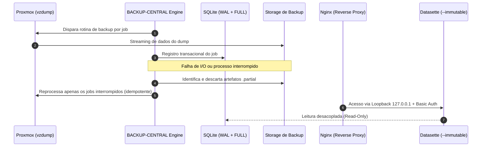
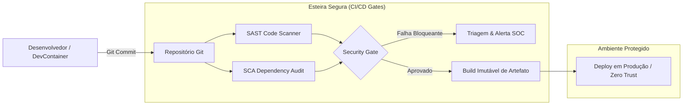
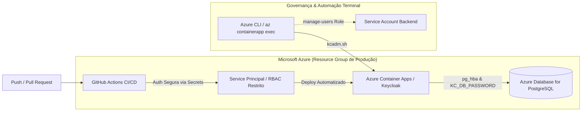
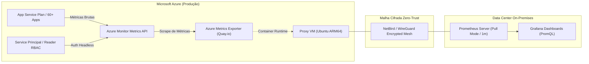
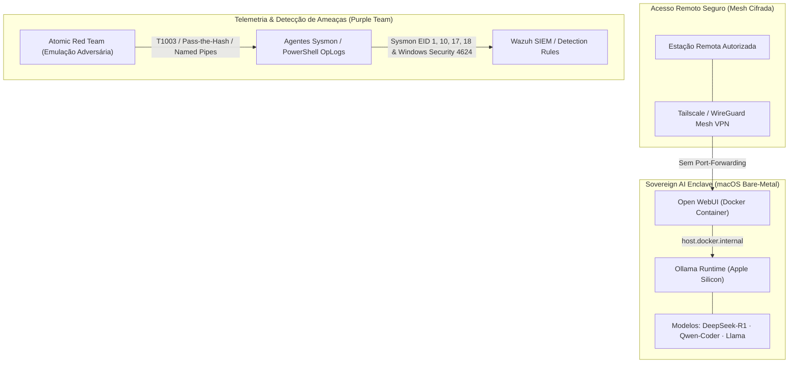
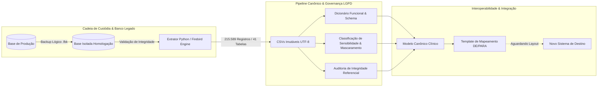
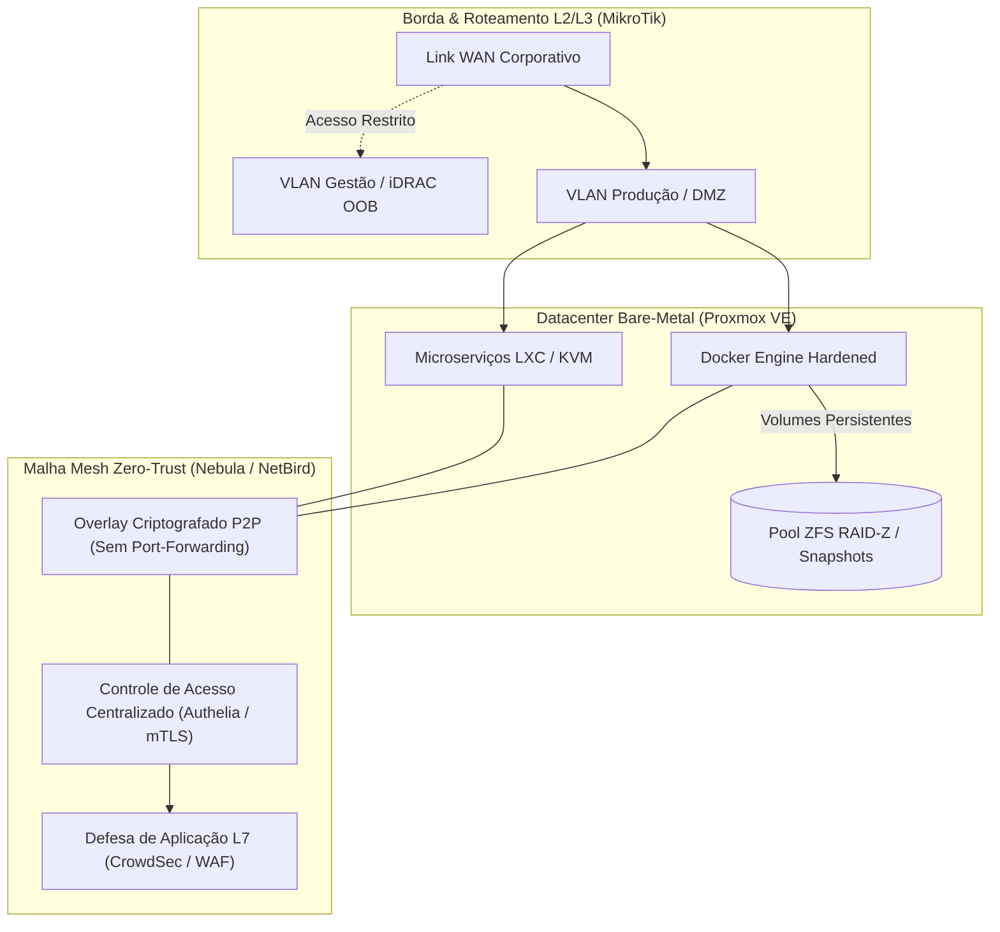

<div align="center">

# Michael
### Infrastructure Architect · Senior DevSecOps & Cloud Security · Critical Systems Resilience

*Engenharia de infraestrutura, automação de esteiras seguras e garantia de disponibilidade determinística para ambientes de missão crítica.*

[](https://github.com/mister-m-1337)
[](https://linkedin.com/in/michael-mendes-ot-security)
[](mailto:)
[](#)

</div>

---

## 🏛️ Visão Arquitetural

> **"Protejo o que não pode parar."**  
> *Linhas de produção farmacêutica, saneamento básico e plantas industriais: ambientes onde indisponibilidade ou violação de integridade não geram apenas perdas financeiras, mas impacto operacional severo e risco físico real.*

Atuo na convergência entre **Cibersegurança Industrial (OT/ICS), Engenharia de Infraestrutura/DevSecOps e Validação de Sistemas Computadorizados (CSV/GxP)**. Minha carreira é dedicada à blindagem, resiliência e conformidade de ecossistemas de missão crítica — desde a sustentação e auditoria em ambientes farmacêuticos industriais contínuos até a liderança tática de operações de SOC multicliente de alta complexidade.

Sobre a base determinística do chão de fábrica e data centers, integro arquiteturas modernas de nuvem (AWS/Azure), infraestrutura declarativa (Terraform/OpenTofu) e esteiras CI/CD seguras (Shift-Left), tornando segurança e conformidade atributos verificáveis no código.

---

### Eixos Estratégicos de Especialidade

* **Segurança OT/ICS & SCADA:** Arquitetura de segmentação e zonas/conduítes orientada por **ISA/IEC 62443**, NIST CSF e Purdue Model. Hardening de camadas de controle e PLCs, análise de integridade em protocolos industriais (Modbus, DNP3) e eliminação de superfícies de ataque em linhas de produção.
* **Validação Farmacêutica (CSV / GxP):** Ciclo completo de qualificação de infraestruturas e validação de sistemas computadorizados (QI, QO, QP) em estrita conformidade com **ANVISA (RDC 658/2022 / RDC 301/2019), GAMP 5 e FDA 21 CFR Part 11**, conectando garantia da qualidade, engenharia e TI.
* **DevSecOps & Resiliência em Nuvem:** Implementação de controles nativos em esteiras de entrega contínua (SAST, SCA, Secret Scanning), governança de identidades e automação de infraestrutura imutável (IaC via Terraform/Ansible) em ambientes híbridos e multi-cloud.
* **Operações de SOC & Resposta a Incidentes:** Operação e governança de centros de defesa cibernética 24/7, mapeamento e correlação de ameaças via **MITRE ATT&CK**, redução contínua de MTTD/MTTR e reporte executivo com foco em risco de negócio.

---

| Princípio | Aplicação Prática |
| :--- | :--- |
| **Zero-Trust** | Nenhum segmento é confiável por padrão; identidade, microsegmentação e overlay cifrado (WireGuard/NetBird) substituem perímetros planos. Serviços administrativos expostos apenas em loopback atrás de proxy reverso autenticado. |
| **Imutabilidade** | Infraestrutura como código versionada, artefatos reprodutíveis e camadas de observabilidade em modo somente-leitura. Mudanças são sempre um novo estado declarado, nunca uma intervenção in-place não rastreada. |
| **Observabilidade Aplicada** | Métricas, telemetria de logs e trilhas de auditoria desacoplados do plano de escrita. A infraestrutura de observabilidade sobrevive à eventual falha do sistema que monitora. |
| **Tolerância a Falhas** | Durabilidade transacional explícita, rotinas de *self-healing* idempotentes e runbooks determinísticos de recuperação contra desastres. |
| **Governança & Risco** | Conformidade tratada como requisito de código (ISA/IEC 62443, GAMP 5, MITRE ATT&CK), com evidências e testes gerados pela própria esteira automatizada. |

---

### 🎯 Atuação & Posicionamento Profissional

Aberto a desafios técnicos e estratégicos em posições de **Arquiteto de Soluções / Infraestrutura, Especialista Sênior em DevSecOps / Cloud Security ou Liderança Técnica de Segurança** em organizações que operam infraestruturas críticas, plataformas digitais de alta escala ou manufatura regulada.

* **Modalidades:** Prestação de Serviços (PJ) ou Posições Corporativas Estratégicas (CLT).
* **Regime:** 100% Remoto ou Híbrido.
* **Contato Direto:** Mensagem direta via LinkedIn ou pelos canais informados no cabeçalho.

---

## 🗺️ Ecossistema de Atuação



---

## 🛠️ Stack Tecnológica & Domínios

**Cloud & Containers**<br>


**IaC & Automação**<br>


**Redes & Borda**<br>


**Cibersegurança & SOC**<br>


**OT / ICS Crítico**<br>


**Virtualização & Métricas**<br>


| Domínio | Ferramentas & Tecnologias | Escopo de Atuação |
| :--- | :--- | :--- |
| **Cloud & Containers** | `AWS` `Azure` `Kubernetes` `Docker` | Landing zones, governança IAM (least privilege), policies de admissão e orquestração de containers distribuídos. |
| **IaC & Automação** | `Terraform` `OpenTofu` `Ansible` `Python` `Bash` | Módulos reutilizáveis, state remoto centralizado com lock, prevenção de drift e runbooks automatizados. |
| **Redes & Borda** | `pfSense` `Fortinet` `WireGuard` `NetBird` `VLANs` | Topologias L2/L3 corporativas, segmentação 802.1Q, firewalls NGFW, Outbound NAT e redes mesh criptografadas. |
| **Cibersegurança & SOC** | `MITRE ATT&CK` `SIEM/SOAR` `Burp Suite` `Nessus` | Threat intelligence, caça a ameaças (threat hunting), engenharia de detecção e contenção de incidentes. |
| **OT / ICS Crítico** | `ISA/IEC 62443` `Modbus` `DNP3` `SCADA` `GAMP 5` | Hardening de ativos operacionais, mitigação de protocolos industriais e qualificação de sistemas críticos (CSV). |
| **Virtualização & Métricas** | `Proxmox VE` `Prometheus` `Grafana` `KQL` | Clusters bare-metal, storage redundante, painéis de camada 7 e telemetria avançada de logs. |

---

## 🚀 Projetos Arquiteturais em Destaque

### 1. BACKUP-CENTRAL — Resiliência & Disaster Recovery para Proxmox
*Ecossistema autônomo de proteção e backup determinístico de máquinas virtuais e containers, desenhado para tolerar falhas de processo e manter integridade absoluta do catálogo de auditoria.*

* **Hardening Transacional em SQLite:** Implementação do motor de dados sob `PRAGMA journal_mode=WAL` e `PRAGMA synchronous=FULL`, prevenindo lockings concorrentes e corrupção em cenários de corte abrupto de energia.
* **Autonomia e Self-Healing:** Rotina de startup que identifica artefatos `.partial`, descarta os arquivos inconsistentes e reprocessa de forma idempotente apenas os jobs interrompidos, sem reexecutar o ciclo completo.
* **Observabilidade Desacoplada e Imutável:** Interface Datasette configurada com a diretiva `--immutable` apontando para snapshots somente-leitura, eliminando bloqueios contra o writer primário do sistema.
* **Segurança de Borda em Loopback:** Painel administrativo isolado na interface local `127.0.0.1`, publicado por proxy reverso Nginx com autenticação e headers defensivos (`Content-Security-Policy`, `X-Frame-Options`, `X-Content-Type-Options`).
* **Telemetria de SLOs:** Exportação de métricas para Prometheus e Grafana para acompanhamento em tempo real de RPO, tempos de execução e volume de dados.



---

### 2. Auditoria de Borda & Otimização L1/L2 — Enterprise Network Infrastructure
*Diagnóstico determinístico e reengenharia arquitetural na borda corporativa, eliminando saturação de tráfego, tempestades de broadcast e anomalias de Camada 2.*

```text
  CENÁRIO ANTES (Saturação L2)                  CENÁRIO DEPOIS (Arquitetural Correto)
  ─────────────────────────────                 ─────────────────────────────────────
  [Link WAN]                                    [Link WAN]
       │                                             │
  [Firewall Appliance]                          [Firewall Appliance]
  └── bridge0 (Software Bridge)                      ├── Interface Trunk (802.1Q)
       ├── Porta igb1 ──[Switch A]                   │     ├── VLAN 10 (Gestão & Borda)
       ├── Porta igb2 ──[Switch B]                   │     ├── VLAN 20 (Servidores & BD)
       └── Porta igb3 ──[Switch C]                   │     └── VLAN 30 (Estações de Trabalho)
             ↑ Loop L2 / MAC Flapping                │
             ↑ CPU em 100% (Interrupt Storms)   [Switch Core L2/L3 Dedicado]
             ↑ Autonegociação em 100baseTX           ├── 1000baseT Full-Duplex Verificado
             ↑ NAT Automático sem Governança         └── Outbound NAT Determinístico
```

* **Desconstrução de Software Bridge:** Remoção da carga de comutação L2 da CPU do firewall, delegando a camada de broadcast e forwarding para hardware dedicado (Switches Core), sanando eventos severos de *MAC flapping*.
* **Saneamento L1/L2:** Correção determinística de auto-negociações degradadas (forçando e validando enlaces a **1000baseT Full-Duplex** sem descarte de quadros).
* **Estabilização de Estados:** Governança das tabelas de estado (State Tables) e substituição de NAT automático por regras explícitas de Outbound NAT por segmento.

---

### 3. Pipeline Hardening & Software Supply Chain Defense
*Arquitetura de esteira CI/CD segura orientada a mitigar vetores complexos de evasão de código e comprometimento de estações de trabalho de engenharia.*



* **Defesa contra APTs & Supply Chain:** Mitigação de ataques em dependências de segundo nível, identificando código malicioso em pacotes aparentemente benignos — com base em campanhas atribuídas a agentes norte-coreanos na esteira de supply chain e engenharia social (ex.: malware OTTERCOOKIE / campanha *Contagious Interview*).
* **Isolamento de Runtime:** Padronização de desenvolvimento em ambientes isolados (DevContainers), impedindo execução de scripts arbitrários diretamente no host da estação de trabalho.
* **Gates Bloqueantes:** Inclusão de scanners SAST/SCA e Secret Scanning como critérios de reprovação automática na esteira de integração contínua.

---

### 4. Cloud Identity & CI/CD Platform Architecture — Azure & Keycloak
*Engenharia de identidade corporativa, automação de esteiras CI/CD seguras e sustentação de microsserviços em produção no ecossistema Microsoft Azure.*

* **Sustentação de Identidade & Contêineres:** Diagnóstico e resolução de falhas críticas de startup no **Azure Container Apps** hospedando o Keycloak. Mapeamento de regras de rede e firewall (`pg_hba.conf` / "Permitir serviços do Azure") no **Azure Database for PostgreSQL**, sincronização determinística de segredos em runtime (`KC_DB_PASSWORD`) e estabilização de revisões de contêiner.
* **Refatoração de CI/CD com Least Privilege (GitHub Actions):** Pivotagem pragmática de runners locais instáveis para autenticação desacoplada via Service Principal corporativo (`az ad sp create-for-rbac`). Aplicação estrita de RBAC delimitada exclusivamente ao escopo do Resource Group de produção e injeção segura de credenciais via GitHub Secrets em esteiras separadas de backend e frontend.
* **Administração de Identity Provider via Terminal (kcadm):** Mitigação de indisponibilidade da interface gráfica através de injeção direta de comandos no runtime do contêiner (`az containerapp exec`), governança de contexto de assinatura (`az account set`) e provisionamento automatizado de roles administrativas (`manage-users`) para Service Accounts de backend.



---

### 5. Hybrid Observability Platform & FinOps Architecture — Azure, Prometheus & Zero-Trust
*Arquitetura de observabilidade híbrida para telemetria de alta densidade em nuvem (App Service Plans multitenant), mitigando custos de ingestão e otimizando volume de transferência de saída.*

* **Estratégia FinOps & Otimização de Tráfego:** minimizando o tráfego de saída a coletas pontuais de métricas e evitando custos de agentes de terceiros na nuvem.
* **Diagnóstico de Confiabilidade & Migração Arquitetural (Push vs. Pull):** Descontinuação de modelo frágil baseado em scripts Bash/Cron e InfluxDB (que gerava falsos positivos e métricas congeladas por `last()` em caso de falha de coleta). Migração para o padrão de mercado **Prometheus (Pull Pattern)**, garantindo detecção instantânea de alvos inoperantes (estado `DOWN`).
* **Tratamento de Latência de API & Métricas Contínuas:** Resolução de retornos nulos causados pela janela de consolidação da Azure Monitor API (offset de 2 minutos). Implantação de coletor especializado em container via registro seguro (Quay.io) e autenticação não-humana (Service Principal RBAC com privilégio de `Reader`).
* **Telemetria Centralizada & Consultas PromQL:** Integração de sondagem direta via endpoint `/probe/metrics/resource` no Prometheus Server on-premises, com consultas dinâmicas no Grafana refletindo a utilização real de CPU e memória sob alta carga.



---

### 6. Sovereign Local AI Enclave & Adversary Emulation — Apple Silicon, Wazuh & MITRE ATT&CK
*Arquitetura de inteligência artificial soberana para segurança ofensiva/defensiva, orquestração local de LLMs e engenharia de detecção comportamental orientada a matrizes de ameaças.*

* **Enclave de IA Soberana & Privacidade Absoluta:** Implantação e tuning de stack de inferência 100% local sobre arquitetura Apple Silicon (Ollama runtime). Orquestração de modelos para raciocínio profundo (*DeepSeek-R1*), engenharia de software/IaC (*Qwen2.5-Coder*) e frameworks especializados em análise de risco e auditoria ofensiva (*Red/Purple Teaming*).
* **Interface Segura & Zero-Trust Mesh:** Contêiner isolado (*Open WebUI*) operando sob Docker Engine, com injeção de *System Prompts* defensivos e acesso externo restrito exclusivamente via malha mesh criptografada ponto a ponto (Tailscale / WireGuard), eliminando abertura de portas em borda de rede.
* **Engenharia de Detecção Avançada (Wazuh & Sysmon):** Modelagem de regras de telemetria profunda correlacionadas à matriz **MITRE ATT&CK** e **NIST SP 800-61 / 800-82r3**. Ingestão e detecção de credenciais em memória (*LSASS / Mimikatz - T1003*), leitura indevida de memória em processos críticos (Sysmon Event ID 10 / ProcessAccess - T1003.001), extração de diretório ativo (*NTDS.dit via ntdsutil*), movimentação lateral via *named pipes* (*PsExec*) e validação por simulação adversária (*Atomic Red Team*).



---

### 7. Dev-Only Synthetic Authentication & Automated E2E Testing Gate
*Engenharia de aceleração de desenvolvimento (DevEx), isolamento de fluxos de autenticação em ambiente de testes e validação contínua ponta a ponta.*

* Implementação de middleware condicional para injeção de sessão sintética em tempo de desenvolvimento. O componente possui trava arquitetural que aborta a inicialização caso DEBUG=False (lançando ImproperlyConfigured), garantindo que a rotina jamais seja instanciada ou exposta no ciclo de vida de produção.
* **Isolamento de Estado & Redirecionamentos:** Tratamento contextual de rotas críticas (`/login`, `/dashboard`, `/logout`) com injeção de marcadores visuais no layout para identificação de sessões sintéticas e garantia de conformidade de acessos.
* **Validação Ponta a Ponta Automatizada:** Suíte de testes unitários de regressão para assegurar a restauração automática do comportamento seguro com a flag desativada, complementada por inspeção visual e funcional automatizada em navegador headless (Playwright) gerando evidências de conformidade operacional.

### 8. Forensic Data Engineering & Clinical Migration Pipeline — Firebird SQL, LGPD & Canonical ETL
*Engenharia de resgate de dados, extração forense determinística e modelagem canônica de dados médicos sensíveis em ambiente regulado sob isolamento estrito.*

* **Preservação e Extração Imutável (Firebird SQL):** Recuperação e congelamento de base de dados relacional legada de prontuário eletrônico. Extração estruturada de 41 tabelas com validação estrita de 215.589 registros com zero divergência de dados, conversão segura de charset (ISO-8859-1 para UTF-8) e preservação integral de campos BLOB clínicos textuais sem corrupção de encodings.
* **Governança de Dados Médicos & LGPD:** Classificação automatizada de sensibilidade por coluna (HEALTH_DATA, SENSITIVE_PERSONAL, PUBLIC) e anonimização/mascaramento de dados cadastrais e identificadores em relatórios e amostras técnicas. Processamento 100% local (air-gapped/on-premises), blindando o pipeline contra vazamento para provedores de nuvem ou APIs externas.
* **Engenharia Reversa & Camada Canônica Intermediária:** Mapeamento não-destrutivo de integridade referencial (PKs, FKs declaradas e inferidas, análise de orfandade), identificação de anomalias cadastrais e geração de dicionário funcional de dados. Estruturação de modelo canônico desacoplado e template de mapeamento DE/PARA para integração determinística com novo software de destino.



---

### 9. Sovereign Bare-Metal Datacenter & Zero-Trust Mesh Architecture — Proxmox, ZFS & Nebula
*Concepção e governança de infraestrutura física dedicada (self-hosted), virtualização de alta densidade, resiliência de storage em nível de bloco e interconexão de serviços em malha privada criptografada.*

* **Camada de Computação & Armazenamento Transacional (ZFS RAID-Z):** Orquestração de hypervisor bare-metal (Proxmox VE) combinando virtualização KVM com contêineres de baixo overhead (LXC). Persistência de volumes de produção estruturada sobre pools ZFS com snapshots atômicos contínuos, replicação assíncrona e mitigação nativa de silent data corruption (*bit rot*).
* **Segmentação Física & Malha Overlay Zero-Trust (Nebula / NetBird):** Segregação estrita de tráfego L2/L3 com roteamento gerenciado (MikroTik), isolando barramentos de gestão fora-de-banda (iDRAC), zonas de produção e redes periféricas. Interconexão de microserviços e nós remotos via malha mesh overlay peer-to-peer criptografada (Nebula), sem abertura de portas desnecessárias em borda de WAN.
* **Governança e Hardening de Stacks de Contêineres:** Adaptação e blindagem de receitas de orquestração Docker para conformidade corporativa. Implementação de autenticação centralizada (Authelia / SSO com mTLS), proxy reverso com mitigação de ameaças de camada 7 (CrowdSec / Traefik) e integração com esteiras de automação operacional orientadas a eventos (n8n e Python).



---

### 10. Industrial Embedded Smart Gateway — Buildroot, OT/ICS Hardening & Galvanic Isolation
*Concepção e implementação de appliance embarcado sob medida para blindagem e criptografia de barramentos seriais industriais em maquinário crítico de manufatura regulada.*

* **Engenharia de Firmware Imutável (Buildroot Linux):** Compilação de sistema operacional embarcado minimalista (footprint de 30 MB) sobre arquitetura ARM Cortex-A53 (Allwinner H618). Sistema de arquivos montado integralmente em memória RAM e partição somente-leitura (**SquashFS**), garantindo tempo de inicialização determinístico (sub-4s) e imunidade absoluta contra corrupção em desligamento abrupto de energia.
* **Isolamento Físico & Tratamento de Telegramas Industriais:** Transceptor serial RS232 com isolamento galvânico (óptico/magnético) para supressão de ruídos induzidos e surtos de tensão de painel elétrico. Daemon especializado (`ser2net`) configurado com controle estrito de *inter-frame timeout*, evitando a fragmentação de frames do protocolo de controle industrial.
* **Criptografia P2P & Microsegmentação (WireGuard + nftables):** Substituição de conversores comerciais vulneráveis por canal cifrado ponto a ponto (**ChaCha20-Poly1305**) interligando o CLP ao IHM supervisório. Regras locais em `nftables` sob política estrita *Default-Drop*, restringindo a porta serial em rede exclusivamente ao IP virtual interno do túnel.
* **IHM Local em E-Paper & Governança Operacional:** Integração de display E-Ink/E-Paper via barramento SPI para telemetria passiva de link e integridade do túnel sem degradação do estado visual em corte de alimentação. Rotina autônoma de diagnóstico e auditoria ativada por dispositivo USB assinado via `mdev`.

```mermaid
flowchart LR
    subgraph Campo_Industrial ["Chão de Fábrica / Painel Elétrico"]
        PLC["CLP Industrial (Omron)"]
        Serial_ISO["Isolador Galvânico RS232 (TTL/RS232)"]
        PLC -->|Cabo Serial Blindado| Serial_ISO
    end

    subgraph Smart_Gateway ["Smart Gateway Embarcado (Buildroot / ARM)"]
        UART["UART SoC (Allwinner H618)"]
        Squash["RootFS Imutável (SquashFS / RAM)"]
        Daemon["ser2net (Framing Determinístico)"]
        WG_Gate["Túnel Cifrado WireGuard"]
        Firewall["nftables (Default-Drop Policy)"]
        EPaper["Display Local E-Paper (SPI)"]

        Serial_ISO --> UART
        UART --> Daemon
        Daemon --> Firewall
        Firewall --> WG_Gate
        Squash -.->|Boot Read-Only| Daemon
        Daemon -.->|Telemetria| EPaper
    end

    subgraph IHM_Supervisorio ["Supervisão & Operação (Windows)"]
        WG_Client["WireGuard Service (Autônomo)"]
        VSP["Driver Virtual COM Port"]
        SCADA["Software SCADA / Runtime"]

        WG_Gate ==>|RJ45 Blindado / ChaCha20| WG_Client
        WG_Client --> VSP
        VSP --> SCADA
    end
```



### 11. Local LLMOps & Autonomous Cyber Assistant Platform — Unsloth, Ollama & pfSense
*Engenharia de modelos locais de inteligência artificial, alinhamento supervisionado para operações Purple Team e integração de agentes autônomos de terminal sob restrições severas de computação.*

* **Alinhamento e Quantização sob Limite de VRAM:** Otimização de pipelines de fine-tuning com **Unsloth** em GPU de consumo restrito (6 GB VRAM), realizando quantização 4-bit (`Q4_K_M`) e governança de contexto (`num_ctx: 4096`). Padronização de saídas no formato **ChatML** com enforcement de matriz quadrivalente determinística (*Análise, Exploração Red Team, Detecção Blue Team e Mitigação*).
* **Pipelines Autônomos de Ingestão & RAG Estruturado:** Construção de rotinas em Python para extração automatizada de manuais técnicos e telemetria de sistemas, convertendo dados não estruturados em pares de treinamento enriquecidos com foco em automação shell avançada e análise forense de processos.
* **Agente Autônomo de Código & Infraestrutura (Aider CLI + Ollama API):** Implantação de ambiente Codex local integrado ao servidor Ollama via interface compatível com OpenAI, orquestrando inspeções ativas de segurança de rede (`ss`, análise de portas de borda) e edição segura orientada a diffs rastreáveis de Git.
* **Análise Forense e Correlação de Tráfego de Borda:** Diagnóstico e triagem de telemetria de firewall (**pfSense**), identificando tentativas de bypass de DNS contidas por políticas *Default Deny*, rajadas STUN/TURN de WebRTC e isolamento de tráfego legítimo de túneis cifrados WireGuard.

---

## 📜 Credenciais & Certificações Técnicas

Formação continuada e qualificações profissionais estruturadas em defesa ativa, conformidade em infraestruturas críticas e segurança ofensiva.

### 🏭 Segurança Industrial (OT/ICS) & Infraestruturas Críticas

* Certificação Redes Industriais Seguras OT/ICS Associado — IBSEC (Instituto Brasileiro de Cibersegurança)
* Redes Industriais Seguras OT/ICS na Prática — IBSEC
* Introduction to CIP (Critical Infrastructure Protection) — OPSWAT Academy

### ☁️ Cloud Security, Inteligência de Ameaças & Defesa

* Segurança na Nuvem (Cloud Security) — IBSEC
* Inteligência de Ameaças e Exposição — Axur
* MITRE ATT&CK — Academia de Forense Digital (AFD)
* EASM (External Attack Surface Management) com ThingsRecon — Academia de Forense Digital
* Network Defense Essentials (NDE) — Acadi-TI
* Segurança de Endpoint — Senac Goiás
* Cyber Academy — Laboratório de Segurança Cibernética — FEBRABAN

### 🔬 Forense Digital, Riscos & Governança de Dados

* Perito Forense Digital — Academia de Forense Digital (AFD)
* Gestão de Riscos Corporativos — Academia de Forense Digital (AFD)
* Oracle MySQL — Administração Profissional — Academia de Forense Digital (AFD)
* Privacy and Data Protection Essentials (PDPE) — EXIN / Instituto Daryus
* Certificação Lean Seis Sigma White Belt — FM2S
* Scrum Foundation Professional Certificate (SFPC™) — CertiProf

### ⚔️ Segurança Ofensiva, Red Team & Hardware

* Hacker Ético Associado — IBSEC
* PRIME Red Team — Avançado & Intermediário — Acadi-TI
* Hardware Hacking — Acadi-TI
* Ataques Denial of Service (DoS) e Botnets — Solyd Offensive Security
* Ataques em Redes Wi-Fi — Solyd Offensive Security
* Pentest Profissional — A Nova Geração — Desec Security

---

## 🎤 Liderança Técnica & Produção de Conhecimento

* **Palestra / Keynote: "A Colisão de Mundos: Por Que o DevSecOps Tradicional Falha em Redes Industriais (OT/ICS)"**  
  *Estruturada para conferências de tecnologia e comunidades de engenharia (DevFest, BSides)*  
  Discussão aprofundada sobre a fricção entre práticas corporativas de TI ágil e a realidade operacional de chão de fábrica e plantas críticas.  
  * **O Abismo de Paradigmas:** Contraste da tríade de segurança tradicional (CIA) contra a primazia de segurança física e continuidade operacional (AIC / Safety). Análise de incidentes operacionais reais provocados por abordagens cegas de TI (ex.: varreduras de portas e testes automatizados causando falhas em PLCs).  
  * **A Ilusão do Air-Gap na Indústria 4.0:** Vetores contemporâneos de quebra de isolamento físico decorrentes de convergência com nuvem, telemetria remota e manutenção de terceiros.  
  * **Zero Trust & DevSecOps Aplicados a OT:** Implementação de microsegmentação fundamentada no Modelo Purdue (ISA/IEC 62443), telemetria estritamente passiva via Deep Packet Inspection (DPI) e pipelines com validação prévia em réplicas digitais (*Digital Twins*) sem impacto na planta ativa.

* **Palestra: "FinOps: Quando seu Pipeline Deploya Dinheiro, Não Só Código"**  
  *Conferência PorteraTech / Hub Goiás*  
  Discussão executiva sobre o impacto financeiro de decisões técnicas em esteiras de entrega contínua. Métodos para introduzir governança de custos em arquiteturas de nuvem (*Policy-as-Code* e alocação via IaC) sem comprometer resiliência, tolerância a falhas ou segurança operacional.

---

<div align="center">

<sub>Arquitetura resiliente não é a ausência de falhas — é a previsibilidade do comportamento quando elas acontecem.</sub>

</div>
